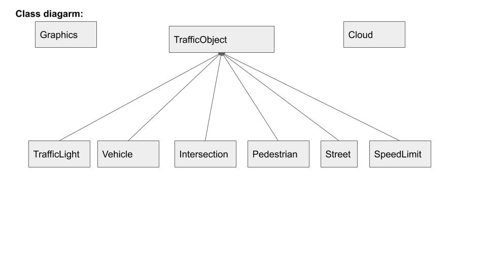
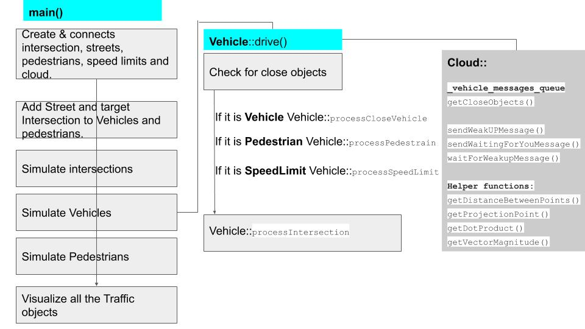
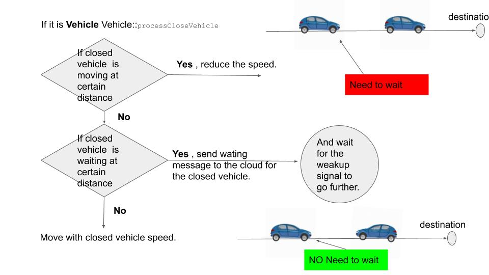
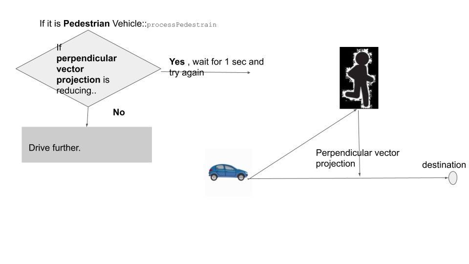
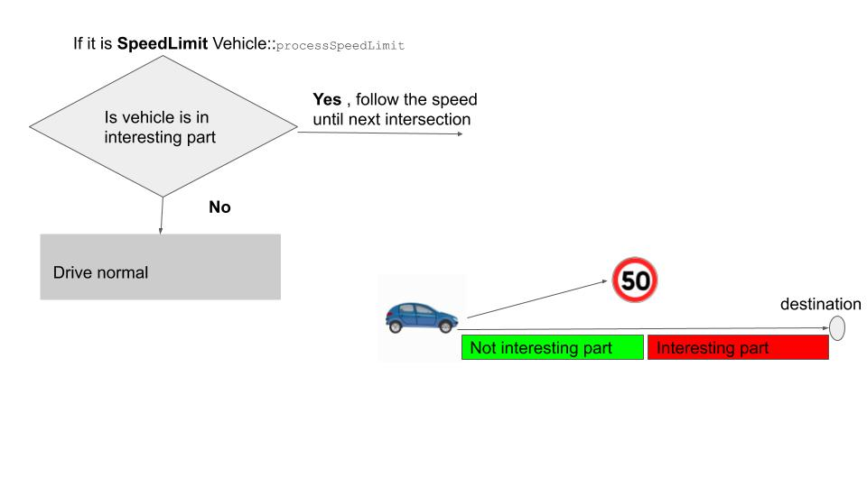

# CPPND: Extended Concurrent Traffic Simulation

## Currently it has the following features:

1. Vehicle to Vehicle communication.
2. Collision avoidance between vehicles. 
3. Collision avoidance between vehicles and Pedestrians.
4. Follow speed limits.
5. Custom vehicles with varying speed.
6. Crossing junctions (As a part of the course exercise.) 

This is the project for the final capstone project of the  course in the [Udacity C++ Nanodegree Program](https://www.udacity.com/course/c-plus-plus-nanodegree--nd213): Concurrency. 
This is an extended version of concurrent traffic simulation.

## Dependencies for Running Locally
* cmake >= 2.8
  * All OSes: [click here for installation instructions](https://cmake.org/install/)
* make >= 4.1 (Linux, Mac), 3.81 (Windows)
  * Linux: make is installed by default on most Linux distros
  * Mac: [install Xcode command line tools to get make](https://developer.apple.com/xcode/features/)
  * Windows: [Click here for installation instructions](http://gnuwin32.sourceforge.net/packages/make.htm)
* OpenCV >= 4.1
  * The OpenCV 4.1.0 source code can be found [here](https://github.com/opencv/opencv/tree/4.1.0)
* gcc/g++ >= 5.4
  * Linux: gcc / g++ is installed by default on most Linux distros
  * Mac: same deal as make - [install Xcode command line tools](https://developer.apple.com/xcode/features/)
  * Windows: recommend using [MinGW](http://www.mingw.org/)

## Basic Build Instructions

1. Clone this repo.
2. Make a build directory in the top level directory: `mkdir build && cd build`
3. Compile: `cmake .. && make`
4. Run it: `./traffic_simulation`.

## Project Descriptions

- **Class Diagram**:
 

- **Main Process Flow**

- **Feature : Vehicle to Vehicle communication** :
The vehicles are able to send messages to a virtual cloud. 
and the virtual cloud is capable of handling message queue. 
other vehicles can request for the incoming message to the cloud. 
along with handling the message queue, it also provides some helper functionality like - 
send closed traffic objects to a vehicle; if it is requested, 
and some linear algebra functionalities.   
   
The technique of conditional thread waiting has been used to wait
for other vehicles inside the cloud class.

- **Feature : collision avoidance between Vehicles** :
The following picture describes a brief overview of collision avoidance between Vehicles:

- **Feature : Collision avoidance between vehicles and Pedestrians.** :
The vehicles are intelligent enough to allow pedestrian for passing the street; the following 
picture describes the algorithm briefly.

- **Feature : Follow speed limits..** :
The vehicles are capable of following the street's speed limit. 
The below pictures shows the algorithm.

- **Feature : Custom vehicles with varying speeds** :
The vehicles move very randomly on it's own with varying speed. 
in the intersection, the incoming flow is controlled with round-robin scheduling technique; meaning the vehicle which reaches the intersection first, 
leaves first. and, if there is a red signal, the vehicle must wait until the signal turns to green again. 

## An explanation of how my submission satisfies the necessary rubric:

The newly introduced class ( cloud , SpeedLimit, Pedestrian) is designed in a OOP way, 
that meets the following rubric criteria.

-**1**: The project uses Object Oriented Programming techniques.

-**2**: All class data members are explicitly specified as public, protected, or private.

-**3**: Classes abstract implementation details from their interfaces, for example - 
 Cloud::waitForWeakupMessage(const int receiver_id);
 Cloud:: sendWeakUPMessage(const int receiver_id); 
 Cloud::sendWaitingForYouMessage(const int sender_id, const int receiver_id); 

-**4**: Appropriate data and functions are grouped into classes. Member data that is subject to an invariant is hidden from the user. 
State is accessed via member functions. 
For example:Cloud:: VehicleMessageQueue<VehicleMessage> _vehicle_messages_queue;  which only was accede by corresponding public function.

-**5**: The project uses multiple threads in the execution. each and every Pedestrians behave as an independent thread.

-**6**: A mutex or lock is used to handle_queue inside the class VehicleMessageQueue. 

-**7**: A condition variable called _cond inside the class VehicleMessageQueue has been used to weak up the thread(Vehicle) waiting for other vehicle.    
